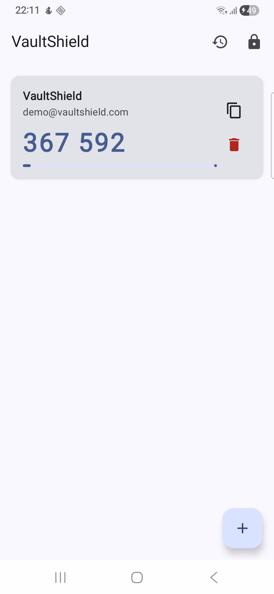
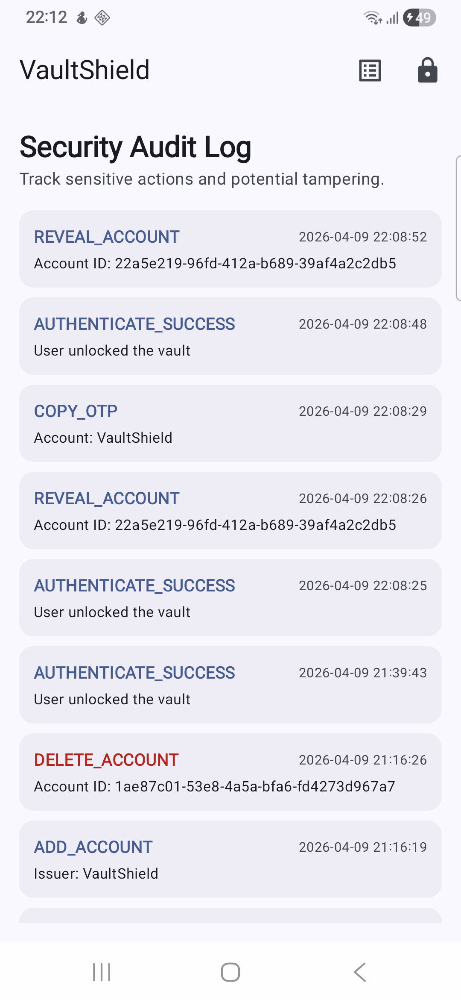

# VaultShield: Secure Android 2FA Authenticator

VaultShield is a project demonstrating a hardened Android TOTP (RFC 6238) authenticator. It prioritizes data integrity, local-first security, and resistance to common mobile attack vectors.
     

## Security Architecture Highlights

VaultShield maps concrete mobile threats to specific technical mitigations:

| Threat Scenario | Mitigation Control | Implementation Details |
| :--- | :--- | :--- |
| **Physical Access / Theft** | Biometric Gating | Mandatory `BiometricPrompt` for vault entry and per-account secret reveal. |
| **Data Extraction / Root Dump** | Authenticated Encryption | `EncryptedSharedPreferences` (AES-256 GCM) with keys in Android Keystore (Hardware-backed where supported). |
| **Overlay / Tapjacking** | UI Hardening | `HIDE_OVERLAY_WINDOWS` (Android 12+) to block malicious screen overlays. |
| **Screen Scraping / Recents** | Prevent Capture | `FLAG_SECURE` to block screenshots and screen recording. |
| **Clipboard Sniffing** | Secure Clipboard | Custom manager with a 30-second auto-clear timer for OTP codes. |
| **Compromised Environment** | Runtime Integrity Checks | Periodic checks for Root (RootBeer), Emulators, and active Debuggers. |
| **Malicious Backups** | Encrypted Export | Client-side password-based key derivation (PBKDF2) + AES-GCM for exports. |
| **Internal Repudiation** | Forensic Audit Log | Secure local logging of sensitive state changes (e.g., secret reveal, export). |

## Technical Implementation

### Data Protection & Storage (Model Distinction)
VaultShield implements a strict architectural boundary between sensitive secrets and non-sensitive metadata to enhance both performance and security:

1. **Metadata Storage (Room Database)**:
   - **What**: Account labels, issuers, and display preferences.
   - **Why**: Stored in a local relational database (Room) to allow for efficient querying, sorting, and UI updates. This prevents the performance bottleneck of decrypting hardware-backed storage just to render a list of account names.
   
2. **Secret Isolation (Hardware-Backed Keystore)**:
   - **What**: The raw Base32 TOTP secrets.
   - **Why**: Isolated in `EncryptedSharedPreferences`. By using the **Android Keystore**, keys are managed in the **TEE (Trusted Execution Environment)** or **StrongBox**, making them inaccessible even to a compromised OS. Secrets are only "pulled" using the Room ID as a lookup key at the exact moment of TOTP generation.
   
3. **Security Benefit**: This separation adheres to the **Principle of Least Privilege**. Even if a vulnerability allowed unauthorized access to the Room database, the attacker would gain no cryptographic material, as the raw secrets are protected by an independent, hardware-rooted layer.

### Security Audit System (Forensics)
In this demo, the **Security Audit Log** is user-visible to demonstrate the capture of sensitive events.
- **Production Hardening**: Uses `BuildConfig.DEBUG` checks to redact detailed technical metadata (e.g., specific Account IDs or Issuer names) in production builds, ensuring the audit trail itself doesn't become a source of sensitive information leakage.
- **Enterprise Deployment Note**: In a production environment, these logs would typically be offloaded to a secure remote SIEM or kept in protected partitions for forensic auditors.
     

### Environment Integrity
The app performs **runtime checks** for:
- **Root/Tamper**: Basic detection via `RootBeer` and build-property analysis.
- **Emulators**: Checking for known virtualized hardware signals.
- **Debuggers**: Detection of attached JDWP debuggers.
- **Signal vs. Guarantee**: These are **defensive signals** intended to increase the cost of an attack. They are not a 100% guarantee against sophisticated kernel-level hooks or advanced persistent threats (APTs).

## Verification & Testing
- **Unit Tests**: `TotpGeneratorTest` validates HMAC-SHA1 output against RFC vectors.
- **Security Tests**: See [docs/security-tests.md](docs/security-tests.md) for manual validation procedures for biometric gating and screenshot prevention.

## OWASP MASVS Mapping
VaultShield targets **MASVS-L2** (Standard Security + Defense-in-Depth):
- **MSTG-STORAGE-1**: Sensitive data never stored in plaintext.
- **MSTG-AUTH-1**: Biometrics enforced for all sensitive state transitions.
- **MSTG-CRYPTO-1**: Industry-standard primitives (AES-GCM, PBKDF2).
- **MSTG-PLATFORM-2**: Implements `FLAG_SECURE` and Anti-Overlay.
- **MSTG-RESILIENCE-1**: Multi-layered environment detection.

## Technical Stack
- **Kotlin & Jetpack Compose**: Modern, reactive UI.
- **Room Persistence**: Efficient metadata management.
- **Dagger Hilt**: Dependency injection for clean, testable architecture.
- **AndroidX Security & Biometric**: Hardware-backed cryptographic APIs.
- **OkHttp**: Configured with **Certificate Pinning** (reserved for future sync functionality) to maintain network resilience.

## Limitations
1. **OS Compromise**: Sophisticated kernel-level spyware may bypass user-space integrity checks.
2. **User Password**: The security of portable backups is bound by the complexity of the user's chosen password.
3. **Physical Coercion**: Biometric controls do not protect against a user being physically forced to unlock the device.

---
